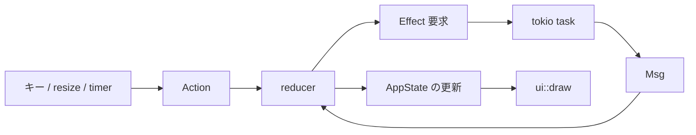

# 責務分離のロードマップ

この文書は、termrain を将来的に保守しやすい構成へ育てるための設計方針である。現在の実装を「すぐ直すべき欠陥」とみなすのではなく、機能開発と同時に安全に分割できるよう、目標と移行順序を記録する。

関連する現在の構造は [内部設計](architecture.md) を参照する。

実装可能な小さな作業単位と AI の実行規約は、[AI 実行タスク](ai-tasks.md) を参照する。

## 方針

- ファイルを短くすること自体を目的にしない。異なる理由で変更される責務を分ける。
- 振る舞いを変えない構造変更と、機能変更・依存更新を同じ PR に混ぜない。
- public API は最小にし、Rust の module privacy を利用して実装詳細を閉じ込める。
- 先にテストや観測点を用意し、移動後も同じ結果であることを確認する。
- 分割後も、呼び出し側から「どこを見ればよいか」が分かる名前と module tree を保つ。
- 1 回の PR では 1 つの境界だけを移す。大規模な一括移動は避ける。

## 現在の状態と分離候補

| 領域 | 現状 | 将来分けたい責務 | 優先度 |
|---|---|---|---|
| JMA provider | `src/api/jma.rs` に予報、タイル取得、画像合成、キャッシュ、変換、地域データが同居する | forecast、radar、tile cache、画像合成、JMA 固有のデコード | 高 |
| Open-Meteo provider | `src/api/open_meteo.rs` に予報変換、WMO 表示変換、RainViewer、地図タイルが同居する | forecast、WMO 変換、radar、tile cache | 中 |
| provider 間の共通処理 | Open-Meteo が JMA module の公開 helper を利用している | タイル座標、画像合成、サンプリングなどの provider 非依存処理 | 高 |
| app orchestration | `app::run` が TUI 初期化、イベント loop、timer、描画、終了処理を持つ | terminal lifecycle、event loop、timer / effect scheduling | 中 |
| 非同期取得 | `app/fetch.rs` が task spawn と state への適用を同居させる | effect 実行、結果の reducer、表示用の画像準備 | 中 |
| input | `app/input.rs` が入力解釈、状態変更、非同期取得の開始を直接行う | 入力から Action への変換、Action の state 遷移、effect 要求 | 中 |
| map | `src/map.rs` が city catalog、取得、ディスク cache、GeoJSON parse、検索を持つ | catalog、cache / download、parse、query | 低〜中 |
| config | `src/config.rs` が schema、default、path 解決、ファイル I/O を持つ | schema、path、repository (load / save) | 低 |
| UI | 画面ごとの widget は既に分かれているが、`ui/mod.rs` に layout、header、footer、共通 widget が残る | root layout、status bar、共通 widget | 低 |

優先度は「行数」だけでは決めない。provider 間の依存や外部 API・画像処理の変更頻度を優先する。

## 目標の module 構成

以下は目標であり、今すぐ全ファイルを作るものではない。必要な機能変更のタイミングで、対応する部分だけを段階的に導入する。

```text
src/
├── api/
│   ├── mod.rs                 # provider 選択の公開窓口
│   ├── provider.rs            # WeatherProvider trait と provider 共通契約
│   ├── models.rs              # CurrentWeather / HourlyPoint / DailyPoint / RadarGrid
│   ├── tiles.rs               # provider 非依存のタイル座標・画像合成・サンプリング
│   ├── jma/
│   │   ├── mod.rs             # Jma の組み立てと trait 実装の入口
│   │   ├── forecast.rs        # 予報 API と JMA JSON の変換
│   │   ├── radar.rs           # ナウキャスト時刻・タイルの組み立て
│   │   ├── cache.rs           # JMA 固有のメモリキャッシュ
│   │   └── decode.rs          # PNG → 降水量 grid の変換
│   ├── open_meteo/
│   │   ├── mod.rs             # OpenMeteo の組み立てと trait 実装の入口
│   │   ├── forecast.rs        # Forecast API とレスポンス変換
│   │   ├── radar.rs           # RainViewer と地図タイルの組み立て
│   │   └── wmo.rs             # WMO code → 表示用データの変換
│   └── geocoding.rs
├── app/
│   ├── mod.rs                 # run の公開入口だけ
│   ├── runtime.rs             # raw mode / alternate screen の取得・復旧
│   ├── event_loop.rs          # tokio::select! と redraw の調停
│   ├── state.rs               # AppState
│   ├── message.rs             # 非同期完了メッセージ
│   ├── action.rs              # 入力から得た利用者操作の表現
│   ├── reducer.rs             # Action / Msg による純粋な状態遷移
│   ├── effects.rs             # HTTP / map load / timer の task spawn
│   └── startup.rs
├── config/
│   ├── mod.rs                 # Config の公開入口
│   ├── schema.rs              # 設定型と default
│   ├── paths.rs               # XDG path 解決
│   └── file.rs                # TOML load / save
├── map/
│   ├── mod.rs                 # MapData の公開入口
│   ├── catalog.rs             # 都市・レイヤ定義
│   ├── cache.rs               # GeoJSON の永続 cache
│   ├── parse.rs               # GeoJSON → Polyline
│   └── query.rs               # bounds に対する segment 抽出
└── ui/
    ├── mod.rs                 # draw の公開入口
    ├── layout.rs              # root layout と領域計算
    ├── header.rs
    ├── footer.rs
    ├── widgets.rs             # 共通パネル枠など
    └── ...                    # current / radar / weekly など既存 widget
```

この tree は設計上の到達点であり、実装前に必要性を再評価する。たとえば `action.rs` / `reducer.rs` は、状態遷移が増えてテストしにくくなった時点で導入する。小さなアプリに抽象化だけを先行導入しない。

## 優先する最初の境界: provider 共通処理

現状、`src/api/open_meteo.rs` は JMA module にあるタイル座標・画像処理 helper を import している。この依存では、JMA の内部を整理すると Open-Meteo が意図せず影響を受ける。

最初に切り出す対象は、次のような provider 非依存の処理である。

- 緯度経度と slippy map tile の相互変換
- タイル画像の補間・サンプリング
- 地図画像と雨雲画像の合成
- 凡例や中心 marker の描画

### 移行手順

1. 既存 helper の unit test を追加または補強する。
2. `src/api/tiles.rs` のような private module へ、関数シグネチャを変えずに移動する。
3. JMA と Open-Meteo の import 先だけを切り替える。
4. `cargo fmt`、Clippy、release test を実行する。
5. 同じ地点・時刻の radar で画像サイズ、bounds、降水 grid が変わらないことを確認する。

完了条件は「JMA と Open-Meteo が相互に private helper を import しない」ことである。provider 固有の URL、時間解釈、キャッシュ方針は共有しない。

## provider 分割の目標

### JMA

JMA は予報データとナウキャスト画像で API 形式・失敗時の意味・キャッシュキーが異なる。そのため、以下の単位で分ける。

- `forecast`: 地域選択、JSON response、現在・時間別・日別の変換
- `radar`: base time / valid time、対象タイルの決定、`RadarGrid` の構築
- `cache`: 雨雲、地図、数値 grid の key と再利用規則
- `decode`: PNG の色から降水量を得る処理

`Jma` 自体は `reqwest::Client` と必要な cache を組み立て、`WeatherProvider` の各メソッドから上記を呼び出す薄い facade にする。

### Open-Meteo / RainViewer

Open-Meteo の予報 API と RainViewer のレーダーは別の外部契約なので、同じ file に閉じ込め続けない。

- `forecast`: URL 組み立て、JSON response、timezone と WMO code の変換
- `wmo`: WMO code から `WeatherIcon`・表示文言へ変換する純粋関数
- `radar`: RainViewer の時刻一覧、雨雲 tile、背景地図 tile、`RadarGrid` の構築

この分割では、WMO code の unit test と RainViewer の fixture test を独立させられる。

## app の目標: state transition と副作用を分ける

現在は input handler が `AppState` を変更し、そのまま fetch task を起動する。これは小さい画面では読みやすいが、入力種別や再取得条件が増えると、同じ処理を別経路で呼んだときに loading state・request id・redraw の整合を崩しやすい。

将来は次の一方向フローを目標とする。



- `Action` は `ZoomIn`、`MoveMap`、`Refresh`、`SetRadarOffset` のような利用者操作を表す。
- `reducer` は I/O を行わず、状態と実行すべき effect を決める。
- `effects` だけが `tokio::spawn`、HTTP、map load を実行する。
- `Msg` は非同期完了・失敗を表し、同じ reducer で state に反映する。

すべてを一度に導入しない。まずは radar 再取得だけを `Action` 化し、ズーム・移動・スクラブ・リサイズ・アニメーションが同じ request-id / loading 処理を通ることを目標にする。

## 失敗状態を設計に含める

成功結果だけでなく、失敗・古い結果・キャンセル相当の状態を明示する。

- `Msg::Error(String)` は現状「最後のエラー」を保持する。将来は `FetchKind` と request id を持たせ、どの取得が失敗したかを区別できるようにする。
- radar の成功結果は最新 request id だけを反映する。失敗結果でも、最新 request に対応する loading state を適切に解消する設計にする。
- 古い成功・失敗結果は、新しい操作に対する UI 状態を上書きしない。
- network failure でも、取得済みの表示を可能な限り残し、footer とログで失敗を知らせる。

この変更では、少なくとも「最新 request の成功」「古い request の成功」「最新 request の失敗」「古い request の失敗」を unit test で区別する。

## config と map の分割時期

`config.rs` と `map.rs` は複数の責務を持つが、現在は provider より変更頻度が低い。先に分割しない。

以下の条件が満たされた時点で分割する。

- 設定が複数の保存先、migration、validation を持つようになった。
- GeoJSON 以外の地図 source や cache policy を追加する。
- map の query / projection / parse を個別に test したくなった。
- 地図データの更新期限・容量制限・削除方針を実装する。

分割後も設定のファイル形式と XDG path は互換に保つ。map cache は利用者のネットワーク負荷を増やさない。

## UI の分割時期

現在の `src/ui/` は画面ごとの widget がすでに分かれているため、最優先ではない。root layout、header / footer、共通 `titled_block` が増えた時に、`layout.rs`、`header.rs`、`footer.rs`、`widgets.rs` へ移す。

UI module には次を持ち込まない。

- `reqwest` や外部 API response
- config の保存
- `tokio::spawn`
- state を直接変更する入力処理

画像 protocol の準備が state 更新に混ざっている部分は、UI 表示に必要な presentation state として境界を明確にする。移動後も、画像 protocol 非対応のテキスト fallback を必ず維持する。

## 実行順序

| Phase | 対象 | 主な成果 | 完了条件 |
|---|---|---|---|
| 0 | 観測点の整備 | 既存の helper、provider 変換、radar 世代管理のテスト | 移動前の振る舞いを test で固定できる |
| 1 | 共通タイル処理 | JMA / Open-Meteo 間の helper 依存を解消 | provider 同士が private 実装へ依存しない |
| 2 | JMA provider | forecast / radar / cache / decode の分割 | `jma/mod.rs` が facade と trait 実装に集中する |
| 3 | Open-Meteo provider | forecast / WMO / radar の分割 | fixture test を責務ごとに置ける |
| 4 | radar state transition | Action / reducer / effect の最小導入 | 全再取得起点が同じ整合性規則を通る |
| 5 | config / map / UI | 変更頻度が上がった領域を必要な分だけ分割 | 目的のない file 増加をしていない |

Phase 1〜4 は個別の PR とする。Phase 5 は実際の機能要求に合わせて判断する。

## 各分割 PR のチェックリスト

- [ ] 変更理由を「別の理由で変わる責務」で説明できる。
- [ ] public な型・関数を必要以上に増やしていない。
- [ ] 移動前後で API URL、timeout、cache key、設定 path、表示文言を変えていない。
- [ ] 外部 API の変換は fixture で検証できる。
- [ ] radar を変更する場合、最新結果だけを反映する test がある。
- [ ] UI を変更する場合、狭い端末と画像 protocol 非対応時を確認した。
- [ ] `cargo fmt --all -- --check`、`cargo clippy --all-targets`、`cargo build --release`、`cargo test --release` を実行した。
- [ ] 構造変更と機能変更を混ぜていない、または混ぜる必要を PR 本文に説明した。

## 今後の設計判断の記録

大きな選択をした場合は、`docs/adr/` に短い ADR (Architecture Decision Record) を追加する。ADR は「なぜその選択をしたか」を残す記録であり、実装作業そのものではない。実装対象は [AI 実行タスク](ai-tasks.md) の task として管理する。ADR が未決定のため task が `proposed` または `blocked` である場合、先に ADR で前提を確定する。

ADR には次を残す。

1. 背景と解決したい問題
2. 選択肢
3. 採用した決定と理由
4. 受け入れるトレードオフ
5. 将来見直す条件

例: 「provider の cache を共有するか」「bounded channel にするか」「地図 cache の有効期限を持つか」。これにより、AI と人間のどちらが後から変更しても、意図を推測せずに済む。
