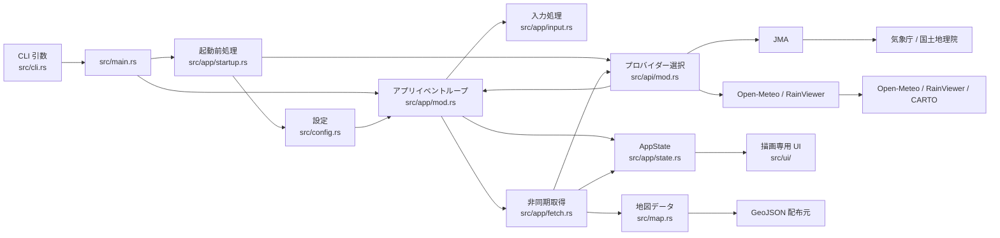
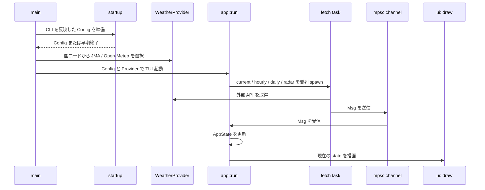
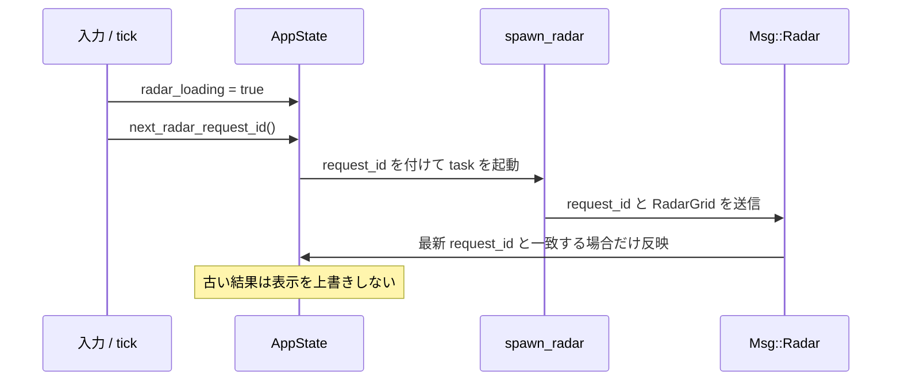

# 内部設計

この文書は termrain の現在の実装構造と、変更時に守るべき設計境界を説明する。新機能を追加する前に、どの層が責務を持つかを確認するための資料である。

将来の責務分離と移行順序は、[責務分離のロードマップ](architecture-roadmap.md) を参照する。

## 全体像



- `src/main.rs` は CLI のパース、ファイルログ初期化、Tokio runtime の起動だけを担当する。
- `src/app/` はアプリケーションの状態・イベントループ・非同期タスクの境界を持つ。
- `src/api/` は外部 API のレスポンスを UI 共通のデータ型へ変換する。
- `src/ui/` は `AppState` を読むだけの描画層であり、HTTP、設定保存、状態変更を行わない。
- `src/map.rs` は地図用 GeoJSON のダウンロード・キャッシュ・描画用データ化を担当する。

## 起動から描画まで



`app::run` の `tokio::select!` は、次の入力を同じイベントループで扱う。

- バックグラウンドタスクからの `Msg`
- キー入力・端末リサイズ
- 設定した間隔での自動更新
- 雨雲アニメーションの tick
- ローディングスピナーの tick

ネットワークや画像合成を UI event loop 上で直接実行しない。時間のかかる処理は `tokio::spawn` し、結果を `mpsc` の `Msg` としてメインループへ返す。

## モジュールごとの責務

| 層 | 主なファイル | 責務 | 置かないもの |
|---|---|---|---|
| Entry point | `src/main.rs` | CLI、ログ、runtime 起動 | UI ロジック、HTTP、状態管理 |
| CLI / startup | `src/cli.rs`, `src/app/startup.rs` | 引数の定義、設定への反映、`--dump` / `--list-city` の早期終了 | TUI 描画 |
| Config | `src/config.rs` | XDG 互換の設定・キャッシュパス、TOML 読み書き | API 呼び出し、描画 |
| Provider API | `src/api/` | API 呼び出し、レスポンス変換、レーダー合成、タイルキャッシュ | UI 固有のレイアウト |
| App state | `src/app/state.rs` | 描画に必要な状態と `Msg` の定義 | HTTP、描画 |
| Async fetch | `src/app/fetch.rs` | task spawn、`Msg` 送信、`Msg` から state への反映 | キー割り当て、レイアウト |
| Input | `src/app/input.rs` | キー・リサイズに応じた状態遷移と再取得要求 | API レスポンスの変換 |
| UI | `src/ui/` | `AppState` を表示する layout / widget | state 変更、HTTP、保存 |
| Map | `src/map.rs` | GeoJSON の取得、キャッシュ、Polyline 化 | TUI の状態遷移 |
| i18n | `src/i18n.rs` | 英語・日本語の UI 文字列 | 表示判断以外のロジック |

## Provider の抽象化

`WeatherProvider` trait は、JMA と Open-Meteo / RainViewer の違いを UI から隠す。

```text
current / hourly / daily / radar
        ↓
共通データ型: CurrentWeather / HourlyPoint / DailyPoint / RadarGrid
        ↓
AppState
        ↓
UI
```

プロバイダーを増やす場合は、UI に provider 固有の条件分岐を追加しない。

1. `WeatherProvider` を実装する。
2. レスポンスを共通データ型へ変換する。
3. `select_provider` に選択条件を追加する。
4. レーダーの時間範囲は `radar_offset_range()` で表現する。
5. API エラーは `anyhow::Result` と `Msg::Error` で返し、TUI を panic させない。

## 非同期状態とレーダーの整合性

ズーム、移動、時系列スクラブ、地図スタイル変更、リサイズ、アニメーション、自動更新はいずれもレーダー再取得を発生させる。古いリクエストの完了順序は保証されないため、`AppState::radar_request_id` を世代番号として使う。



この経路を変更するときは、すべての起点で次を確認する。

- 新しい request id を発行しているか。
- loading 表示・再描画が一貫しているか。
- 古い成功結果が新しい地図位置や時刻を上書きしないか。
- エラー時に利用者へ状態を伝え、TUI が操作不能にならないか。

## UI と端末互換性

UI は画像プロトコルを使える場合に Kitty / Sixel 向けの合成画像を表示し、使えない場合でもテキスト系のフォールバックを維持する。

レイアウトを変更する場合は、以下を守る。

- `saturating_sub`、`Constraint::Min` などを使い、狭い端末で underflow や panic を起こさない。
- `desired_radar_aspect()` を変更する場合は、端末のセルサイズと画像のピクセル比の両方を考慮する。
- 描画中に stdout / stderr へ通常ログを出さない。ログは `src/main.rs` が初期化するファイル出力へ送る。
- 表示文字列を変える場合は `src/i18n.rs` の英語・日本語をそろえる。

## 設定・キャッシュ

- 設定は `Config` を通し、`$XDG_CONFIG_HOME/termrain` または `~/.config/termrain` に保存する。
- キャッシュは `$XDG_CACHE_HOME/termrain` または `~/.cache/termrain` に置く。
- 設定フィールド追加時は、既存の `config.toml` を読めるよう `serde(default)` または適切な既定値を検討する。
- 地図データとタイルは既存キャッシュを再利用し、不要なネットワーク要求を増やさない。

## 変更の置き場所

| 変更したいこと | 最初に確認する場所 |
|---|---|
| CLI option を追加する | `src/cli.rs`, `src/app/startup.rs` |
| 設定項目を追加する | `src/config.rs`, README の設定例 |
| 新しい天気 provider を追加する | `src/api/mod.rs`, 新しい `src/api/*.rs` |
| API レスポンスを変換する | 対応する `src/api/*.rs` |
| 非同期取得の開始・適用方法を変える | `src/app/fetch.rs`, `src/app/state.rs` |
| キー操作を追加する | `src/app/input.rs`, `src/i18n.rs`, README |
| レイアウト・見た目を変更する | `src/ui/` |
| 地図データを追加する | `src/map.rs` |
| UI 表示文言を変える | `src/i18n.rs`, 必要に応じて README |

## 設計レビューのチェックポイント

PR では、実装が動くだけでなく次を確認する。

- 責務をまたぐ処理を UI や entry point に混ぜていないか。
- HTTP や重い画像処理が event loop を block していないか。
- 外部 API 失敗が `Result` / `Msg::Error` を経由し、panic にならないか。
- 非同期レーダー結果の世代管理、loading state、再描画が全起点で揃っているか。
- 設定の後方互換性、キャッシュの再利用、terminal fallback を壊していないか。
- 利用者に見える変更なら i18n、README、CHANGELOG の更新要否を確認したか。
