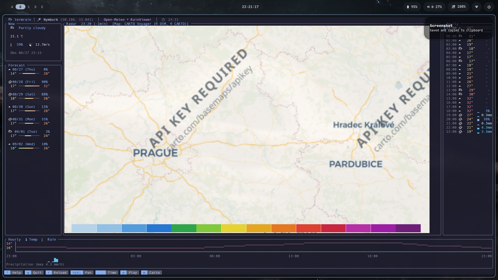

# Issue #17: 背景地図で `API KEY REQUIRED` が表示される問題

## 概要

Issue #17では、チェコ国内の地点を指定したときに、天気予報は表示されるものの、背景地図に次の透かしが表示されることが報告されている。

```text
API KEY REQUIRED
carto.com/basemaps/api_key
```

これはtermrainの設定ファイルにAPIキーを入力していないことが直接の原因ではない。修正前のtermrainは、APIキー不要の公開タイルとしてCARTO VoyagerのURLを使っていたが、そのURLが現在はHTTP 200でAPIキー要求の画像を返している。

## CARTO側の変更時期

CARTOの公式`basemap-styles`リポジトリでは、2026-08-14 11:21 UTCに「ラスタ地図にAPIキーが必要になり、ラスタ地図を廃止する」という内容のcommitが作成されている。[2] その変更を含むPR #48は、2026-08-20 15:53 UTCにmergeされた。[1][3]

PR本文には、未認証のラスタタイルに`API key required`の透かしを付けていることが明記されている。[1] 現在のCARTO公式ページも、CARTO basemapの利用にはAPIキーが必要であると案内している。[4]

したがって、公開情報から確認できる範囲では、CARTOがAPIキー必須化を公式に告知した時期は2026-08-14〜2026-08-20 UTCの間である。CDNが実際に透かし画像へ切り替わった正確な時刻については、公開履歴やアーカイブから確認できなかったため断定しない。Issue #17の報告時点では、すでにこの仕様変更の影響を受けている。

代替地図の比較と選定理由は、[地図プロバイダー選定調査](map-provider-research.md)にまとめた。

## Issueの再現情報

Issue #17に報告された環境は次のとおり。

- termrain 0.3.4
- Arch Linux
- Kitty
- 座標: `50.186, 15.041`
- 起動コマンド: `termrain --lat 50.186 --lon 15.041`



画像出典: [Issue #17](https://github.com/iorinu/termrain/issues/17)

スクリーンショットでは、次の処理は正常に動作している。

- `Open-Meteo + RainViewer`の天気・雨雲データ
- Kittyによる画像描画
- 背景地図の画像取得と合成

異常なのは、背景地図画像の内容だけである。

## 修正前の実装

`origin/main`では、デフォルトの地図スタイルが`CartoVoyager`になっていた。

```rust
Self::CartoVoyager => format!(
    "https://basemaps.cartocdn.com/rastertiles/voyager/{}/{}/{}.png",
    z, x, y
),
```

Open-Meteoプロバイダーは、取得したレスポンスのHTTPステータスだけを確認していた。

```rust
let resp = self.client.get(&url).send().await?;
let img = if resp.status().is_success() {
    let bytes = resp.bytes().await?;
    image::load_from_memory(&bytes)
        .context("地図タイルデコード失敗")?
        .to_rgba8()
} else {
    image::RgbaImage::from_pixel(256, 256, image::Rgba([240, 240, 240, 255]))
};
```

CARTOのレスポンスはHTTP 200かつPNGなので、termrainはそれを正常な地図タイルとして読み込む。そのPNGにAPIキー要求の透かしが含まれているため、透かしがそのままレーダー画像に合成される。

## 再現確認

修正前の`origin/main`が使うCARTO URLを、termrainと同じUser-Agentで取得した。

```sh
curl -fsS \
  -A 'termrain/0.1 (+https://github.com/iorinu/termrain)' \
  -o /tmp/termrain-carto-before.png \
  -w 'HTTP %{http_code}, %{content_type}, %{size_download} bytes\n' \
  'https://basemaps.cartocdn.com/rastertiles/voyager/5/28/12.png'
```

取得結果:

```text
HTTP 200, image/png, 9417 bytes
```

HTTPエラーではないが、取得した画像には`API KEY REQUIRED`の透かしがあった。したがって、Issue #17の症状は現在も外部タイルへのリクエストだけで再現できる。

## APIキー設定の有無

修正前のソースコードと設定には、CARTO APIキーを読み込む項目や処理は存在しない。

- `Config`にAPIキーのフィールドはない
- 設定ファイルにAPIキーを書く仕様はない
- CARTO URLへAPIキーを付加する処理もない

そのため、利用者がCARTOのWebサイトで発行したAPIキーをtermrainの設定ファイルへ追加すれば解決する、という設計ではない。Issueの利用者にAPIキーの入力場所を案内するだけでは、現在の実装には反映されない。

## 原因の判定

| 仮説 | 判定 | 根拠 |
|---|---|---|
| Open-MeteoまたはRainViewerのAPIキーが必要 | 否定 | Issueの画面でも天気と雨雲データは表示されている |
| Kittyの画像描画に失敗している | 否定 | 地図画像は描画されており、透かしの内容も読める |
| termrainの設定にAPIキーを書き忘れている | 否定 | APIキーを読む設定項目・処理が存在しない |
| CARTOのタイルサービス側の仕様・提供条件が変わった | 確認済み | 旧URLがHTTP 200でAPIキー要求画像を返す |
| キャッシュが古い画像を保持している | 可能性が低い | 地図画像キャッシュはプロセス内メモリだけで、再起動時に破棄される |

## 次の修正候補

元の「APIキー不要」という設計を維持するなら、CARTO Voyagerを使い続けるのではなく、APIキー不要の背景地図へ切り替えるのが自然である。候補としてOpenStreetMapの標準タイルを確認した。

```text
https://tile.openstreetmap.org/{z}/{x}/{y}.png
```

termrainのUser-Agentを付けた取得では、正常な地図画像をHTTP 200で取得でき、APIキー要求の透かしはなかった。ただし、OpenStreetMapのタイル利用ポリシーに従い、次の対応が必要になる。

- アプリを識別できるUser-Agentを付ける
- OpenStreetMapの帰属表示を維持する
- タイル利用量や利用目的をポリシーの範囲内に保つ

CARTO APIキーを設定可能にする案もあるが、ユーザーごとのキー管理が必要になり、現在の「キー不要」の設計から外れるため、第一候補にはしない。

## 現在の状態

0.4.0向けの修正ではCARTO Voyagerをデフォルトから外し、OpenFreeMap Libertyをデフォルトにした。`carto_voyager`設定はCARTO Voyagerそのものを選択し、現在のAPIキー要求画像を比較用に表示する。`m`キーではOpenFreeMap Liberty、OpenStreetMap、CARTO Voyager、国土地理院標準地図、国土地理院航空写真の5種類を巡回できる。OpenFreeMapはMapLibre styleとMVTをezuでRGBA画像へ描画してから、既存の雨雲画像合成へ渡す。

- Issue: [iorinu/termrain #17](https://github.com/iorinu/termrain/issues/17)
- 修正前コードを基準に再現確認済み
- OpenStreetMap Standardのタイル取得、User-Agent、帰属表示を実装済み
- OpenFreeMap Libertyのstyle、TileJSON、MVT、glyph/sprite取得を実装済み
- APIキー値などの秘密情報は取得・記録していない

## Sources

[1] https://github.com/CartoDB/basemap-styles/pull/48
[2] https://github.com/CartoDB/basemap-styles/commit/aac8ff6710b5401e3d8972fb8df08cfb3366b2f6
[3] https://github.com/CartoDB/basemap-styles/commit/64d082a6bc6039b1a0a0a9fb5312330fedd0bba9
[4] https://carto.com/basemaps
