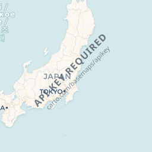
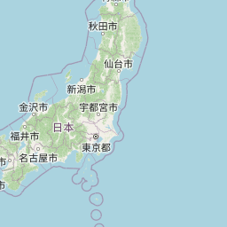
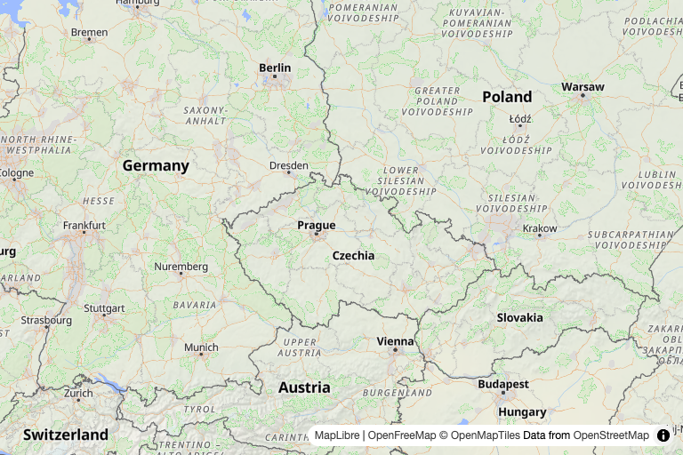
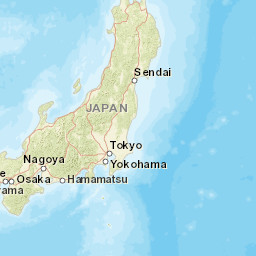

# Issue #17: 地図プロバイダー選定調査

## 調査日時

2026-09-08 UTC

## 結論

Issue #17の復旧用デフォルトは、見た目とAPIキー不要の条件を両立するOpenFreeMap Libertyにする。OpenStreetMapとCARTO Voyagerも比較用に残し、国土地理院標準地図と航空写真も日本国内向けの選択肢として保持する。

理由は、termrainが現在すでにPNG/JPEGのラスタタイルを取得して`image::RgbaImage`へ変換しているため、地図URLと表示上の帰属情報を変更すれば対応できるからである。ベクタタイル描画用の新しい大きな依存関係や、画像合成処理の作り直しを必要としない。

OpenStreetMapの標準タイルサーバーには利用ポリシーがある。User-Agent、帰属表示、リクエスト量を守ることを実装条件にする。詳細は「実装時の条件」に記載する。

OpenFreeMapはAPIキー不要で利用できる。公式のQuick StartどおりMapLibre styleとベクタタイルを使うため、termrainにはezuのCPUレンダラーを追加し、MVTをRGBA画像へ描画してから既存の雨雲画像合成へ渡す方式で対応した。OpenStreetMapより依存関係と初回描画処理は大きいが、CARTO Voyagerに近い見た目を選択できる。

## 候補地図の表示例

同じ地点を比較できるように、Issue #17と同じ座標付近（緯度50.186、経度15.041）を使った。ラスタタイルの例はズーム5・タイル座標`x=28, y=12`で取得し、OpenFreeMapは同じ中心座標・ズームで公式の`Liberty` styleをMapLibreから描画した。画像は背景地図だけで、termrainの雨雲レーダー画像は重ねていない。

### CARTO Voyager（現在の状態）



HTTP 200のPNGだが、地図ではなく`API KEY REQUIRED`の透かし画像が返る。[1]

### OpenStreetMap Standard



通常の地図タイルが返る。表示時には`© OpenStreetMap contributors`の帰属表示が必要になる。[5][6]

### OpenFreeMap Liberty



道路、都市名、行政境界などが表示される。これはPNGタイルではなく、OpenFreeMap公式のstyle URLをMapLibreで描画したプレビューである。[7][8]

### Esri World Street Map



正常なJPEGの地図タイルが返る。複数のデータ提供元に関する帰属表示が必要で、公式メタデータではサービスが更新されていない状態とされている。[9]

画像ファイルはこのドキュメントと同じIssueフォルダの`images/`に保存している。実装後のtermrain画面では、ここに示した地図へ雨雲レーダー画像やUIが重なるため、最終的な見た目は別途termrainで確認する。

## 候補の比較

| 候補 | APIキー | 現在のコードとの互換性 | 主な制約 | 判定 |
|---|---|---|---|---|
| CARTO Voyager ラスタ | 必須化。未認証リクエストは透かし画像 | 高い | ラスタ地図が廃止予定 | 採用しない |
| OpenStreetMap Standard ラスタ | 今回のURL取得では不要 | 高い。既存の画像合成を利用できる | User-Agent、帰属表示、利用量の制約。SLAなし | 当面の第一候補 |
| OpenFreeMap Liberty | 不要。公式サイトは制限なし・登録不要・APIキー不要と説明 | ezuでMapLibre style/MVTをRGBAへ変換 | ezu依存、style変換・glyph取得・CPU描画が必要 | 選択可能な比較候補 |
| Esri World Street Map ラスタ | 今回のタイル取得では不要 | 高い。JPEGを既存処理で読める | サービス情報に「成熟サポート中で更新なし」と記載 | 採用しない |

## CARTO Voyager

CARTOの公式`basemap-styles`リポジトリは、未認証のラスタタイルに`API key required`の透かしを付けていると説明している。[1] CARTO公式ページも、basemapはAPIキーが必要で、月500万タイルリクエストまでのfair use limitを案内している。[4]

Issue #17の再現で取得したCARTOタイルは、HTTP 200のPNGでありながらAPIキー要求の透かしを含んでいた。HTTPステータスだけで成功判定する現在の実装とは相性が悪い。

## OpenStreetMap Standard

OpenStreetMap Wikiは標準タイルのURLを次のように掲載している。[6]

```text
https://tile.openstreetmap.org/{z}/{x}/{y}.png
```

この調査では、termrainのUser-Agentを付けて次のタイルを取得した。

```sh
curl -fsS \
  -A 'termrain/0.3.5 (+https://github.com/iorinu/termrain)' \
  -o /tmp/termrain-osm.png \
  -w 'HTTP %{http_code}, %{content_type}, %{size_download} bytes\n' \
  'https://tile.openstreetmap.org/5/28/12.png'
```

調査時の結果:

```text
HTTP 200, image/png, 16651 bytes
```

取得画像はAPIキー要求の透かしがない通常の地図タイルだった。現在のtermrainのラスタ画像処理で扱える形式である。

### 実装時の条件

OpenStreetMap FoundationのTile Usage Policyでは、次の条件が示されている。[5]

- 正しいタイルURLを使う
- OpenStreetMapのライセンス帰属を地図上に明確に表示する
- アプリ名を含む明確で一意なUser-Agentを送る
- bulk download、scrape、prefetchを行わない
- `Cache-Control: no-cache`や`Pragma: no-cache`を送らない
- ポリシー変更やアクセス停止の可能性を前提にする

termrainにはすでに`termrain/0.1 (+https://github.com/iorinu/termrain)`というUser-Agentがある。地図切り替え時には、バージョン表記をどう管理するか確認する。また、`© OpenStreetMap contributors`を表示する場所をUI上で明確にする必要がある。

OpenStreetMap Wikiの一覧では、標準タイルは寄付で運営される無料サービスとして掲載されているが、同時に各サービスの利用ポリシーを守るよう注意されている。[6]

## OpenFreeMap

OpenFreeMap公式サイトは、地図表示数・リクエスト数の制限がなく、登録、ユーザーデータベース、APIキー、Cookieが不要だと説明している。[7]

一方、Quick Startは次のようなMapLibre style URLを使っている。[8]

```text
https://tiles.openfreemap.org/styles/liberty
```

このstyleは、調査時にHTTP 200のJSONとして取得できた。styleのversionは8で、ベクタタイルのsourceと多数のレイヤーを定義していた。つまり、現在のtermrainが直接取得しているPNG/JPEGタイルとは形式が異なる。

termrainでは、OpenFreeMapのstyle JSONをezuのstyleへ変換し、versioned TileJSONから取得したMVTをRGBAタイルへ描画する。描画結果はOpenStreetMapと同じ`image::RgbaImage`の経路に入り、RainViewer画像との合成方式は変更しない。高ズームではNatural Earthのラスタソースを透明画像で束縛し、不要な低ズーム画像取得を避ける。低ズームではezuのラスタソース取得を使う。

## Esri World Street Map

EsriのWorld Street Mapサービスは、調査時に次のタイルをHTTP 200のJPEGとして返した。

```text
https://server.arcgisonline.com/ArcGIS/rest/services/World_Street_Map/MapServer/tile/{z}/{y}/{x}
```

実際のレスポンスは`image/jpeg`で、APIキー要求の透かしは確認できなかった。しかし、サービスの公式メタデータには`Subject: In mature support; no longer updated.`と記載されている。[9] また、Esri、HERE、Garmin、USGS、OpenStreetMap contributorsなど複数のデータ提供元に関する著作権表示が必要になる。[9]

画像形式の互換性は高いが、新しいデフォルト地図として依存する対象には向かない。

## 実装判断

Issue #17の最小修正では、次の順序を推奨する。

1. CARTO Voyagerをデフォルトの地図ソースから外す
2. OpenStreetMap Standardラスタを選択肢に残す
3. 既存の`carto_voyager`設定をCARTO Voyagerとして選択可能にする
4. OpenFreeMap Libertyをデフォルトにして、5種類を`m`キーと設定ファイルから選択可能にする
5. `© OpenStreetMap contributors`またはOpenFreeMap/OpenMapTilesの帰属を表示する
6. User-Agent、style/MVT取得、タイル取得頻度を確認する
7. URL、設定互換、Open-Meteoの海外地点fallbackを固定テストする
8. 実際の海外地点で、APIキー不要の背景地図にAPIキー要求の透かしが出ないことを手動確認する

現在の実装ではOpenFreeMap Libertyをデフォルトにしている。`radar.open_free_map_road_scale`で道路幅を調整でき、国土地理院の2種類は日本国内だけで選択できる。

## Sources

[1] https://github.com/CartoDB/basemap-styles/pull/48
[4] https://carto.com/basemaps
[5] https://operations.osmfoundation.org/policies/tiles
[6] https://wiki.openstreetmap.org/wiki/Raster_tile_providers
[7] https://openfreemap.org
[8] https://openfreemap.org/quick_start
[9] https://server.arcgisonline.com/ArcGIS/rest/services/World_Street_Map/MapServer
[10] https://github.com/reearth/ezu
[11] https://crates.io/crates/ezu
